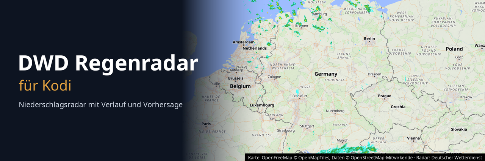

<p align="center">
  
</p>

# DWD Regenradar für Kodi

Kodi-Add-on (`script.dwd.rainradar`), das das Niederschlagsradar des Deutschen
Wetterdienstes als animierte Vollbildkarte zeigt. Ableger des Plasma-Widgets
[plasma-rain-radar](https://github.com/willheisenberg/plasma-rain-radar).

## Funktionen

- Radar vom DWD-GeoServer (`maps.dwd.de`), Hintergrundkarte im Stil „Liberty“
  von OpenFreeMap wie im Plasmoid, gerendert von einem eigenen Kartenserver
  (Docker-Container), beides in EPSG:3857 deckungsgleich
- 1 bis 3 Stunden Verlauf und optional 2 Stunden Vorhersage in 5-Minuten-Schritten
- Zoomstufen 0 bis 4, gezoomt wird immer auf den eigenen Standort (bis man den
  Ausschnitt von Hand verschiebt)
- Standort automatisch per IP-Adresse (ipwho.is, Rückfall auf ip-api.com und
  freeipapi.com, 24 h zwischengespeichert) oder manuell als Koordinaten
- Aktualisiert sich selbst, sobald ein neues Radarbild verfügbar ist
- Braucht Kodi (≥ 19 Matrix, Python 3) und Docker auf dem Kodi-Gerät
  (LibreELEC: Add-on „Docker“ aus dem LibreELEC-Repository)

## Bedienung

| Taste | Funktion |
|---|---|
| ◀ / ▶ | Bild zurück / vor (stoppt die Animation) |
| OK, Play/Pause | Animation starten / stoppen |
| ▲ / ▼ | Auf den Standort hinein- / herauszoomen |
| Menü (C) | Standort, ganz Deutschland, Ausschnitt verschieben, neu laden, Einstellungen |
| Zurück | Beenden |

## Installation

```bash
./build.sh            # erzeugt dist/script.dwd.rainradar-<version>.zip
```

In Kodi: *Einstellungen → Add-ons → Aus ZIP-Datei installieren*. Vorher muss
*Unbekannte Quellen* erlaubt sein. Für die Entwicklung kann man den Ordner
`script.dwd.rainradar` auch direkt nach `~/.kodi/addons/` verlinken.

### Kartenserver

Das Add-on bringt einen Dienst mit, der nach der Installation und bei jedem
Kodi-Start prüft, ob der Kartenserver läuft, und ihn sonst selbst einrichtet:

```bash
docker run -d --name dwd-rainradar-tiles --restart unless-stopped \
  -p 127.0.0.1:8585:8080 -v <addon_data>/tileserver:/data:ro \
  maptiler/tileserver-gl:v5.6.0 --config /data/config.json
```

Beim ersten Mal lädt Docker das Image (rund 1,2 GB), das dauert einige Minuten.
Kodi meldet Beginn und Ende. Solange der Server fehlt, zeigt das Radar keinen
Kartenhintergrund und oben rechts den Hinweis „Kartenserver wird gestartet“.
Der Container belegt im Betrieb etwa 600 MB Arbeitsspeicher und ist nur von
Kodi selbst aus erreichbar (127.0.0.1). Er bleibt nach einer Deinstallation
des Add-ons bestehen; entfernen mit `docker rm -f dwd-rainradar-tiles`.

## Technik

- **Einstellungen:** Kodi zeigt in `settings.xml` (Format v1) nur Text-IDs aus
  `resources/language/*/strings.po` an. Neue oder geänderte Texte übernimmt
  Kodi erst nach einem Neustart.
- **Hintergrundkarte:** Das Plasmoid nutzt MapLibre mit OpenFreeMap. Das sind
  Vektorkacheln, die Kodi nicht zeichnen kann. Deshalb rendert `tileserver-gl`
  denselben Stil zu einem Bild je Ausschnitt (`/styles/liberty/static/…`,
  1600×900 Punkte in doppelter Auflösung). Einzelne Kacheln wären möglich,
  schneiden aber Beschriftungen an den Kachelgrenzen ab. Die Vektordaten holt
  der Container weiterhin online bei OpenFreeMap. Kartenbilder liegen 30 Tage
  im Cache.
- **Störfarben:** Der WMS liefert eine graue „kein Echo“-Fläche und eine
  magentafarbene Abdeckungslinie. Das Plasmoid filtert die mit einem Shader.
  Hier wird das Radar als `png8` (Palettenbild) angefordert, und
  `palette.py` setzt die betroffenen Paletteneinträge im `tRNS`-Chunk auf
  transparent, mit denselben Regeln wie `radar_cleaner.frag`. Pillow ist dafür
  nicht nötig.
- **Cache:** Bilder liegen unter `special://profile/addon_data/script.dwd.rainradar/cache`.
  Verlaufsbilder werden nur einmal geladen. Vorhersagebilder hängen vom
  Basiszeitpunkt ab und werden bei jeder Aktualisierung neu geholt.
- **Module:** `geo`, `frames`, `wms`, `palette`, `store` und `tileserver` sind
  Kodi-unabhängig. `window.py` enthält die Oberfläche, `service.py` richtet den
  Kartenserver ein.

## Tests

```bash
python -m pytest              # offline, inkl. Fenster-Smoke-Test mit Kodi-Stubs
python -m pytest -m netzwerk  # echter Abruf beim DWD
```

## Lizenz

MIT, siehe [LICENSE](LICENSE). Radardaten: Deutscher Wetterdienst. Karte:
[OpenFreeMap](https://openfreemap.org) © [OpenMapTiles](https://openmaptiles.org),
Daten © [OpenStreetMap](https://www.openstreetmap.org/copyright)-Mitwirkende.
